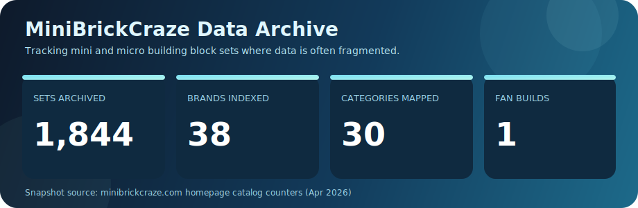
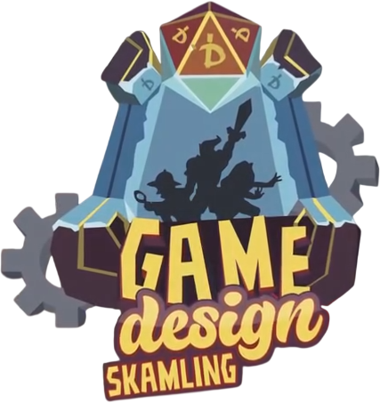
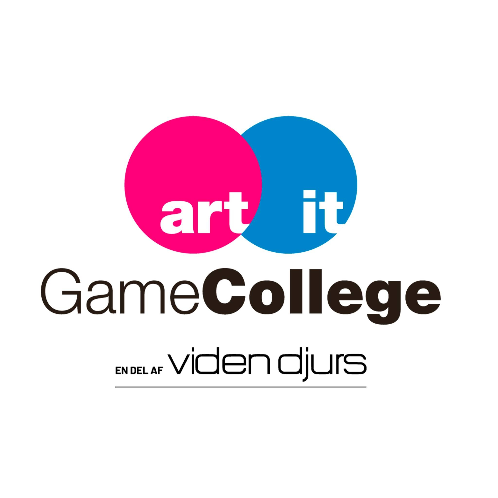

# Juliwa | Game Tech Builder and Educator

## Biography
🏳️‍⚧️ 22 year old trans girl and rhythm game nerd from Denmark with a train obsession.

I started building interactive systems in grade school through Microbits, Scratch, LEGO Mindstorms, and other occasional classroom projects.
That early mix of code, hardware, and game logic turned into a long-term path in interactive design and development.

In 8th grade, I completed a Scratch project that marked a major milestone in my early portfolio:

- [8th Grade Scratch Project](https://scratch.mit.edu/projects/364336229/embed)

I then continued into a high school specializing in game design, where we worked with multiple game makers, level editors, Dream™ on PlayStation, Crey, and Unity.
After that, I graduated from a game college where we built physical and interactive installations, including arcade projects and games integrated across college building walls.
During that period, I also participated in a two-week project at Edmonds College in Seattle, plus a one-week project at University of Skövde and Sweden Game Arena.

I am currently undertaking an academic IT bachelor education.

## MiniBrickCraze Data Embed

	

This custom embed highlights the archive scale of [MiniBrickCraze](https://minibrickcraze.com/), a catalog focused on underserved mini and micro building block brands.

## Education Journey

| Stage | Focus |
|---|---|
| Grade School | Microbits, Scratch, LEGO Mindstorms, and occasional applied tech projects |
| 8th Grade Highlight | Scratch game project and first full interactive build |
| Game Design High School | Game makers, level editing workflows, Dream™ on PlayStation, Crey, Unity |
| Game College Graduate | Physical arcade concepts, wall-scale interactive projects, collaborative production |
| International Experience | Two-week project at Edmonds College in Seattle and one-week project at University of Skövde and Sweden Game Arena |
| Current | Academic IT education at bachelor level |

## Professional Background

- Commissionary and contract work for small and medium indie studios.
- Primary commercial focus on Roblox programming and 3D modelling.
- Hired educator in youth camps and school lessons.
- Extensive volunteer contributions in quality assurance, bug fixing, security fixing, and localization.

## Current Focus

- Building robust interactive systems with a game-development mindset.
- Combining technical implementation with educational communication.
- Improving pipeline quality through QA, debugging, and secure-by-default practices.

## Future Direction

- Continue bridging game technology and applied software engineering.
- Expand larger-scale multiplayer and interactive environment projects.
- Grow impact through education, mentoring, and community-based development.

## Visual Highlights

	
	&nbsp;&nbsp;&nbsp;
	

## Stack and Domains

---

> Building playful systems with technical depth, educational value, and real-world reliability.

<!--
Setup notes:
1) Replace YOUR_GITHUB_USERNAME in the GitHub activity cards.
2) If needed, update terminology for tools listed as dream:tm: and crey.
3) Add portfolio and contact links once ready.
-->
